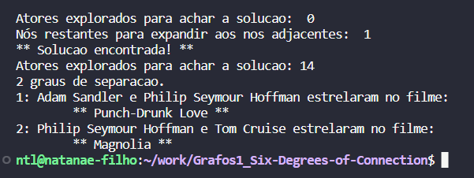

# Grafos1_Six-Degrees-of-Connection

**Número da Lista**: 28 
**Conteúdo da Disciplina**: Grafos 1

 

## Alunos
|Matrícula | Aluno |
| -- | -- |
| 19/0042419  |  Davi Matheus da Rocha de Oliveira |
| 19/0058650  |  Natanael Fernandes Coelho Filho |

## Sobre 

Nosso projeto se baseia na ideia inicial do grafo de Kevin Bacon, que é um exemplo de grafo onde cada nó representa um ator ou atriz e cada aresta representa uma conexão entre dois atores que atuaram juntos em um filme ou programa de TV. O objetivo original do grafo era mostrar quais atores têm uma relação mais próxima com Kevin Bacon e quantos graus de separação existem entre eles. No entanto, em nosso projeto, não nos limitamos a procurar apenas as conexões de Kevin Bacon. Em vez disso, expandimos o alcance do grafo para incluir qualquer ator ou atriz em nosso conjunto de dados. Dessa forma, é possível explorar as conexões entre todas as celebridades disponíveis e analisar as diferentes redes de conexões dentro da indústria do entretenimento.

## Screenshots

# Print da busca entre Bruna Marquezine e Tom Holland

# Print da busca entre Adam Sandler e Tom Cruiser

# Print da busca entre Adam Sandler e Cary Grant

*OBSERVAÇÃO: pela base ser grande, busca demora um bom tempo para retorna resultado de que não foi encontrado conexão entre os atores.*

## Instalação 
**Linguagem**: Python 
**Framework**: Nenhum 

python main.py

## Uso 

Para utilizar o programa não é necessário nenhuma lib ou framework externo. Apenas ter o python3 em sua maquina. Seguindo os passo a passos a baixo poderá executar o projeto desenvolvido pela equipe:

1. Certifique-se de ter o Python3 instalado em sua máquina. Se você não tiver o Python3 instalado, você pode baixá-lo gratuitamente no site oficial do Python (https://www.python.org/downloads/).
2. Clone e entre no diretorio do projeto em seu computador.
3. execute o comando `python3 main.py`
4. Espera os dados dos arquivos csv serem carregados
5. Apos você terá que inserir 2 nomes de atores presentes na base.
6. Caso atores tenham participado de mesmo filme ele retorna resultado do filme
6.1. Caso não possuam um filme em comum, irá apresentar quantos graus são necessários até ser possível encontrar ator target.

## Outros 
Se o programa não encontrar uma conexão entre os nós de celebridades, percorrer 1000 nós pode ser suficiente para interromper a aplicação. Isso evita que a aplicação entre em um loop quase infinito devido ao tamanho do dataset.

Link para apresentação se encontra no about do projeto.

